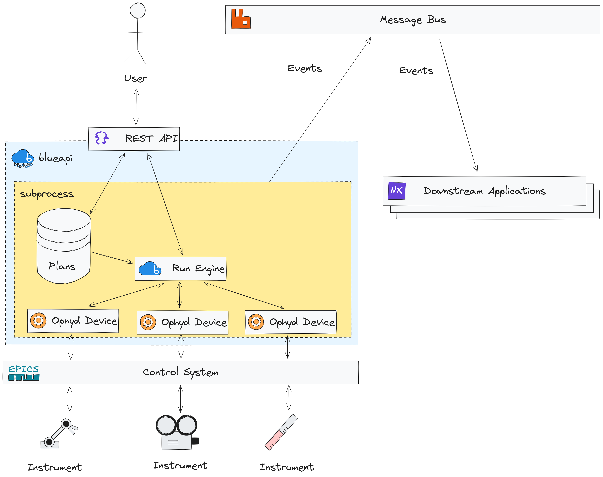

# blueapi

[](https://github.com/DiamondLightSource/blueapi/actions/workflows/code.yml)
[](https://github.com/DiamondLightSource/blueapi/actions/workflows/docs.yml)
[](https://codecov.io/gh/DiamondLightSource/blueapi)
[](https://pypi.org/project/blueapi)
[](https://opensource.org/licenses/Apache-2.0)

Lightweight bluesky-as-a-service wrapper application. Also usable as a
library.

|               |                                                          |
|---------------|----------------------------------------------------------|
| PyPI          | `pip install blueapi`                                    |
| Source code   | <https://github.com/DiamondLightSource/blueapi>          |
| Documentation | <https://DiamondLightSource.github.io/blueapi>           |
| Releases      | <https://github.com/DiamondLightSource/blueapi/releases> |

This module wraps [bluesky](https://blueskyproject.io/bluesky) plans and
devices inside a server and exposes endpoints to send commands/receive
data. Useful for installation at labs where multiple people may control
equipment, possibly from remote locations.



The main premise of blueapi is to minimize the boilerplate required to
get plans and devices up and running by generating an API for your lab
out of type-annotated plans. For example, take the following plan:

``` python
import bluesky.plans as bp
from blueapi.core import MsgGenerator

def my_plan(foo: str, bar: int) -> MsgGenerator:
    yield from bp.scan(...)
```

Blueapi's job is to detect this plan and automatically add it to the
lab's API so it can be invoked easily with a few REST calls.

See <https://DiamondLightSource.github.io/blueapi> for more detailed
documentation.
