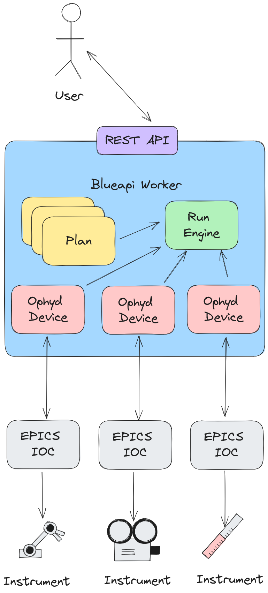

blueapi
===========================

|code_ci| |docs_ci| |coverage| |pypi_version| |license|

Lightweight bluesky-as-a-service wrapper application. Also usable as a library. 

============== ==============================================================
PyPI           ``pip install blueapi``
Source code    https://github.com/DiamondLightSource/blueapi
Documentation  https://DiamondLightSource.github.io/blueapi
Releases       https://github.com/DiamondLightSource/blueapi/releases
============== ==============================================================

This module wraps bluesky_ plans and devices inside a server and exposes endpoints to send commands/receive data.
Useful for installation at labs where multiple people may control equipment, 
possibly from remote locations.

|concept|

The main premise of blueapi is to minimize the boilerplate required to get plans
and devices up and running by generating an API for your lab out of type-annotated 
plans. For example, take the following plan:

.. code:: python

    import bluesky.plans as bp
    from blueapi.core import MsgGenerator

    def my_plan(foo: str, bar: int) -> MsgGenerator:
        yield from bp.scan(...)

Blueapi's job is to detect this plan and automatically add it to the lab's API so it
can be invoked easily with a few REST calls. 

.. _bluesky: https://blueskyproject.io/bluesky

.. |code_ci| image:: https://github.com/DiamondLightSource/blueapi/actions/workflows/code.yml/badge.svg?branch=main
    :target: https://github.com/DiamondLightSource/blueapi/actions/workflows/code.yml
    :alt: Code CI

.. |docs_ci| image:: https://github.com/DiamondLightSource/blueapi/actions/workflows/docs.yml/badge.svg?branch=main
    :target: https://github.com/DiamondLightSource/blueapi/actions/workflows/docs.yml
    :alt: Docs CI

.. |coverage| image:: https://codecov.io/gh/DiamondLightSource/blueapi/branch/main/graph/badge.svg
    :target: https://codecov.io/gh/DiamondLightSource/blueapi
    :alt: Test Coverage

.. |pypi_version| image:: https://img.shields.io/pypi/v/blueapi.svg
    :target: https://pypi.org/project/blueapi
    :alt: Latest PyPI version

.. |license| image:: https://img.shields.io/badge/License-Apache%202.0-blue.svg
    :target: https://opensource.org/licenses/Apache-2.0
    :alt: Apache License

..
    Anything below this line is used when viewing README.rst and will be replaced
    when included in index.rst

See https://DiamondLightSource.github.io/blueapi for more detailed documentation.
