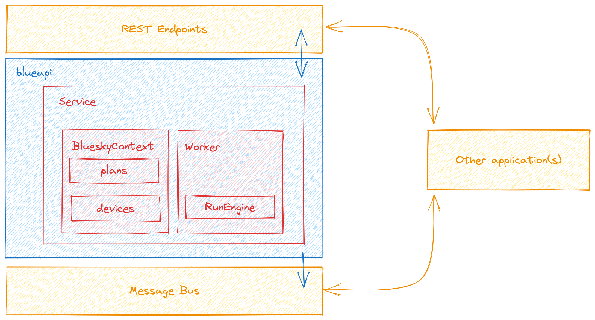

Architecture
============

Blueapi performs a number of tasks:

* Managing the Bluesky RunEngine_, giving it instructions and handling its errors. Traditionally this job has been done by a human with an IPython_ terminal, so it requires automating.
* Maintaining a registry of plans and devices. In the aforementioned IPython_ case, these would have just been global variables.
* Communicating with the outside world, accepting instructions to run plans, providing updates on plan progress etc.

These responsibilities are kept separate in the codebase to ensure a clean, maintainable architecture.

Key Components
--------------

    main components

The ``BlueskyContext`` Object
^^^^^^^^^^^^^^^^^^^^^^^^^^^^^

Holds registries of plans and devices as well as a number of helper methods for 
registering en-masse from a normal Python module. 

The Worker Object
^^^^^^^^^^^^^^^^^

Wraps the Bluesky ``RunEngine`` and accepts requests to run plans. The requests include the name 
of the plan and a dictionary of parameters to pass. The worker validates the parameters against
the known expectations of the plan, passes it to the ``RunEngine`` and handles any errors.

The Service Object
^^^^^^^^^^^^^^^^^^

Handles communications between the ``BlueskyContext`` and ``Worker`` and sets up subscriptions for
publishing Bluesky event documents to the message bus. This object is injected as a dependency into
(using the FastAPI_ dependency injection system) to all REST endpoints, exposing their methods to 
the REST API.

The REST API
^^^^^^^^^^^^

Exposes methods of the ``Worker`` to REST endpoints, which are used by the CLI as well.
Written with FastAPI_, this layer also validates request and response bodies/parameters.

.. _RunEngine: https://nsls-ii.github.io/bluesky/run_engine_api.html
.. _IPython: https://ipython.org/
.. _FastAPI: https://fastapi.tiangolo.com/lo/
