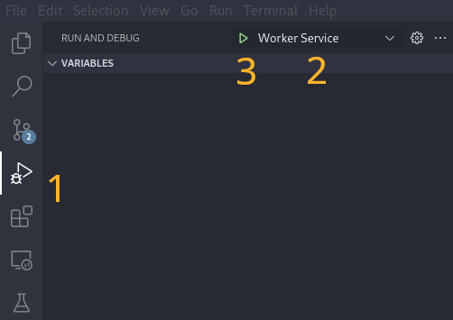

# Run/Debug in a Developer Environment

Assuming you have setup a developer environment, you can run a
development version of the bluesky worker.

<div class="seealso">

<span class="title-ref">./dev-install</span>

</div>

## Start Bluesky Worker

Ensure you are inside your virtual environment:

``` shell
source venv/bin/activate
```

You will need to follow the instructions for setting up ActiveMQ as in
<span class="title-ref">../../user/how-to/run-cli</span>.

The worker will be available from the command line (`blueapi serve`),
but can be started from vscode with additional debugging capabilities.

1.  Navigate to "Run and Debug" in the left hand menu.
2.  Select "Worker Service" from the debug configuration.
3.  Click the green "Run Button"

<figure>

<figcaption aria-hidden="true">debug in vscode</figcaption>
</figure>
