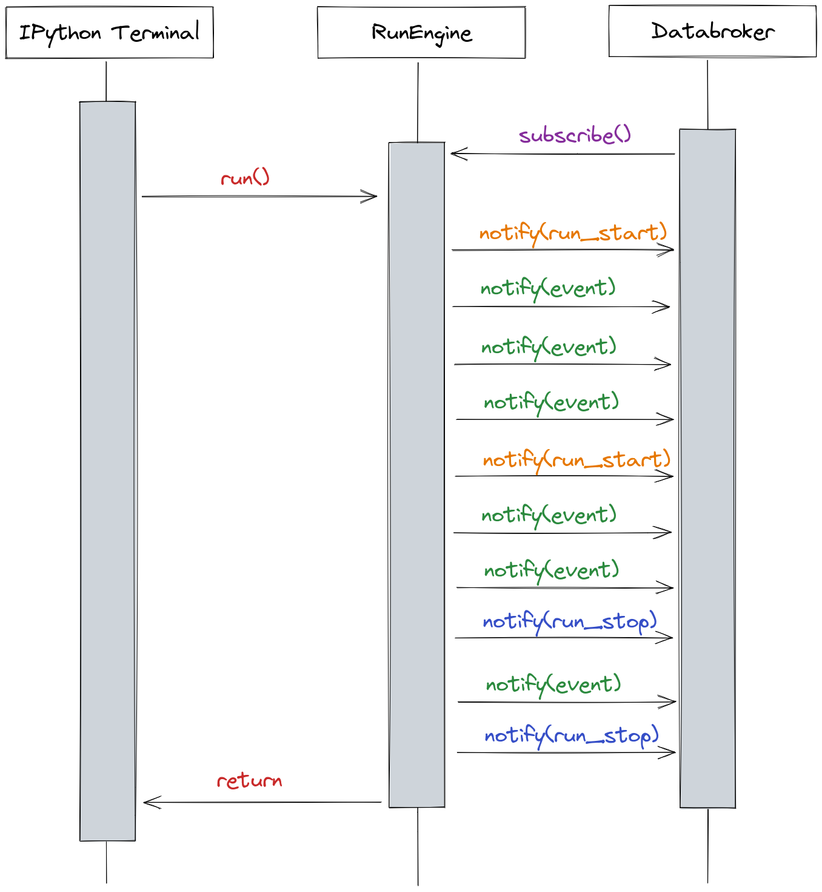

# Events Emitted by the Worker

Blueapi adds new events on top of the [`bluesky event model`](https://blueskyproject.io/event-model/main/index.html).

## Reasons

Since the `RunEngine` is traditionally used by a human in front of an IPython terminal, it
sometimes assumes intuitive behaviour. The worker replaces the human and so must fill in the
gaps.

The base engine programmatically emits data events conforming to the `bluesky event model`_. These
are meant to be handled by other subscribing code (e.g. databroker) and are decoupled from concerns such as whether
a plan has started, finished, paused, errored etc. See the example below:

Note the gap between the start of the plan and the issue of the first [`run start document`](https://blueskyproject.io/event-model/main/user/explanations/data-model.html#run-start-document), and the similar gap
for the stop document vs end of the plan, thsse are typically used for setup and cleanup.
Also note that a plan can produce an arbitrary number of runs. This decoupling is fine in an IPython terminal
because a human user can see when a plan has started, can see when it's finished and can see which runs are
associated with which plans.

## New Events

For the case of automation, we introduce a new set of events outside of the event model, specifically
pertaining to the running of the plan and state of the `RunEngine`. At a minimum, an event is emitted
every time the engine:

* Starts a new plan
* Completes a plan
* Fails/errors

In the latter case, information about the error is also included.

## Correlation ID

When controlling plans programmatically, it can be useful to verify that event model documents really are related to
the plan you just asked the worker to run. The worker will therefore bundle a correlation ID into the headers of
messages containing documents.

see also [`Microsoft Playbook on Correlation IDs`](https://microsoft.github.io/code-with-engineering-playbook/observability/correlation-id/)

ActiveMQ will give this header a different name depending on the protocol you use.

| Protocol | Header name      |
|----------|------------------|
| JMS      | jms_correlationID|
| STOMP    | correlation-id   |
