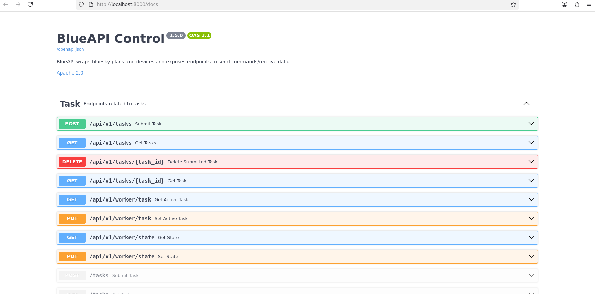
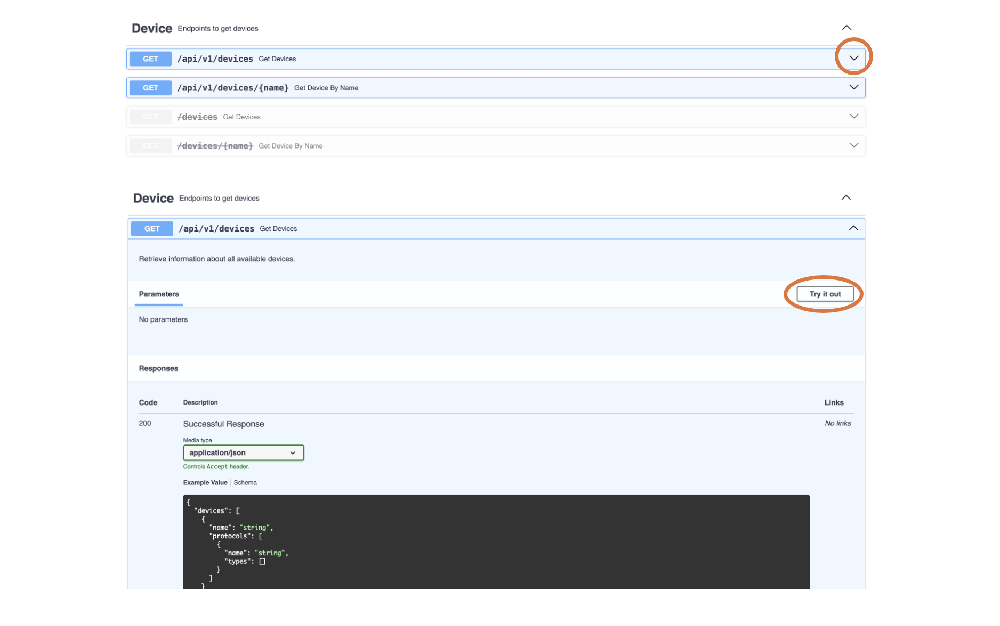
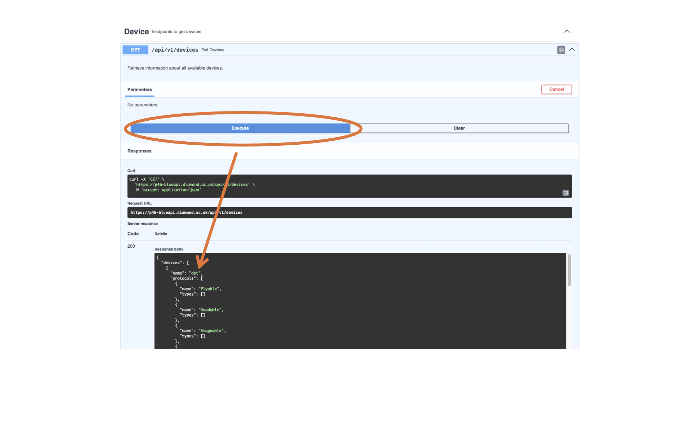
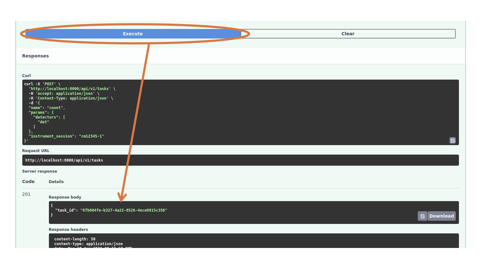
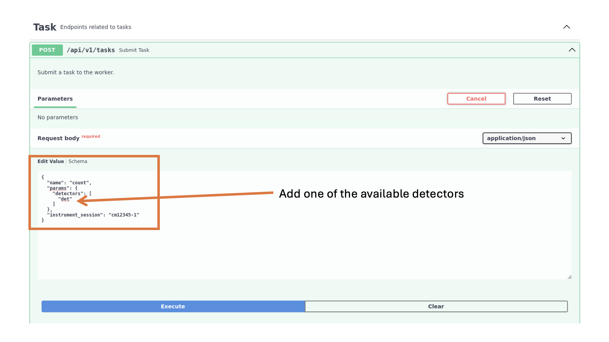
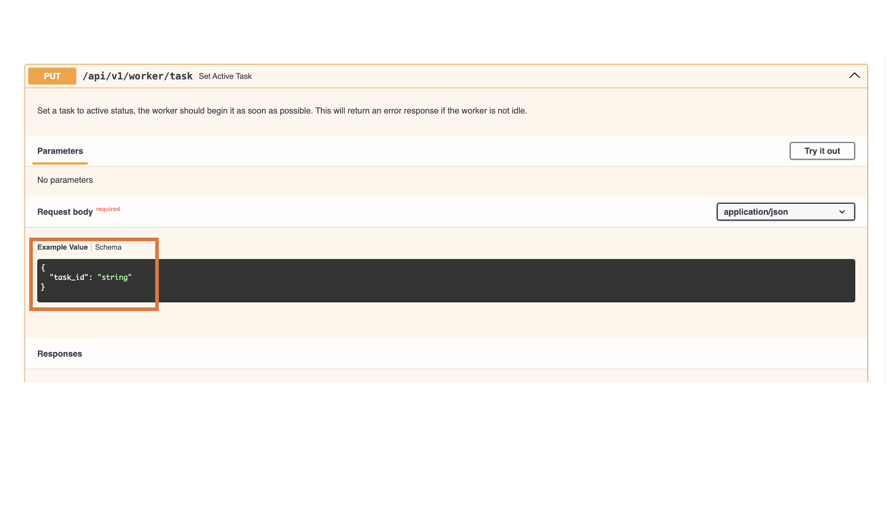
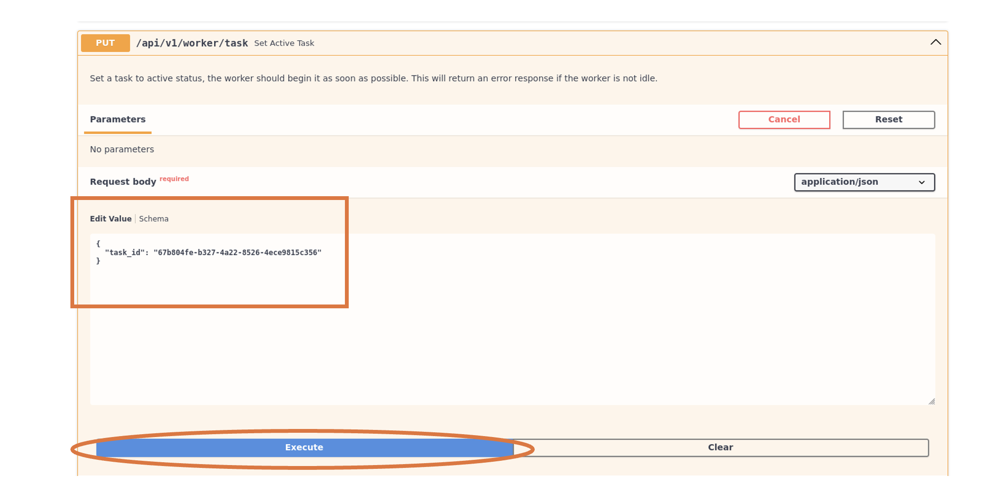

# 6. Run a Plan from Docs page

As well as running plans through the CLI, it is possible to run plans using the docs page. This is an easy way to run one plan but if you need to run multiple plans, it may be easier to use the CLI.

In the terminal window where the worker is running, scroll to this line in the logs:

```
INFO uvicorn.error Uvicorn running on http://localhost:8000 (Press CTRL+C to quit)
```
Open the link (ctrl+click) and this should take you to the BlueAPI Control docs page. It should look like this:




Scrolling down will show you endpoints grouped. The different groups are described below. 

## Definitions:
- Plan: a set of instructions for one aspect of experiment orchestration. More details can be found [here](https://blueskyproject.io/bluesky/v1.13.1rc1/plans.html)
- Task: one individual instance of the plan being run. 
- Device: hardware defined via ophyd protocols. For more information visit [dodal](https://github.com/DiamondLightSource/dodal) and its [Glossary page](https://diamondlightsource.github.io/dodal/main/reference/glossary.html).
- Environment - definition already provided under the endpoint. 
- Meta - definition already provided under the endpoint.

## Steps for running a plan
1. Find available devices. 

The first recommended step is to find out what devices are available on the instrument. Scroll down to the 'Get Devices' endpoint (/api/v1/devices) and press the downwards arrow which should expand it to show the 'Try it out' button. Click the 'Try it out' button to enable further interaction. 



Next, press the 'Execute' button and scroll down to 'Responses' where you should see available devices (e.g. 'det' in the example below). Take note of the device name for later use.



2. Create a task using one of the available devices.

Scroll back up to the 'Submit Task' endpoint (/api/v1/tasks). The default setting that should appear in the request body is the example of a 'count' task using detector 'x' and instrument session 'cm12345-1'. 



Press the 'Try it out' button and replace the placeholder 'x' in the request body with the device you took note of in step 1 ('det' in this example). The instrument session can be left as 'cm12345-1' for the purposes of this tutorial.



Press 'Execute' and you should receive a '201' response that contains a 'task_id'. At the end of the response body box, press the clipboard symbol to copy this 'task_id'. 


3. Set created task in the previous step to be the active task 

After creating a task in Step 2, it still needs to be set to be the active task. Scroll down to the 'Set Active Task' endpoint (/api/v1/worker/task). The default for 'task_id' should be 'string'.



Press 'Try it out' and paste the copied 'task_id' from earlier in the 'Request' body.



Press the 'Execute' button and scroll down to 'Responses' and check if you got a '200 Successful Response'. The BlueAPI docs page only provides feedback for submitting the task to be the active task. To check if the plan actually ran successfully, check the logs (e.g. through ArgoCD, see below).

4. Check the logs in the terminal window where the blueapi server is running

To confirm if the plan ran successfully check the terminal logs. You should see something like: 

```
INFO blueapi.worker.task_worker Task ran successfully - returned: None
```

## Troubleshooting
- 401 Response/cannot Execute plan - reload whole BlueAPI docs web page and log-in again using Keycloak. 
- 2XX Task was created but could not be run successfully, no response - check logs for correct instrument session, have motor limits been exceeded?
- New plan changes have been pushed to the repo but the plan isn't showing up 
    - May need to pull through PlanDev and reload the environment
    - Make sure the blueapi pod is pointing to the correct commit in ArgoCD (check `values.yaml` file in relevant depolyment repo). 
        - Update `values.yaml` as needed, re-submit and re-create a task using BlueAPI and run again using same steps as above. 
