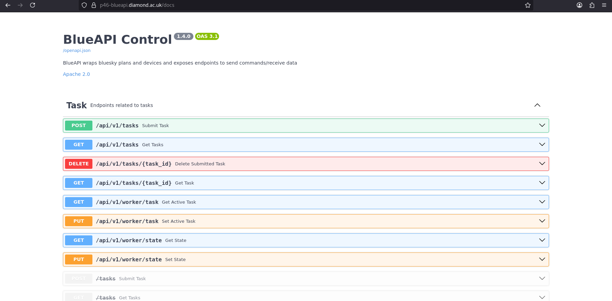
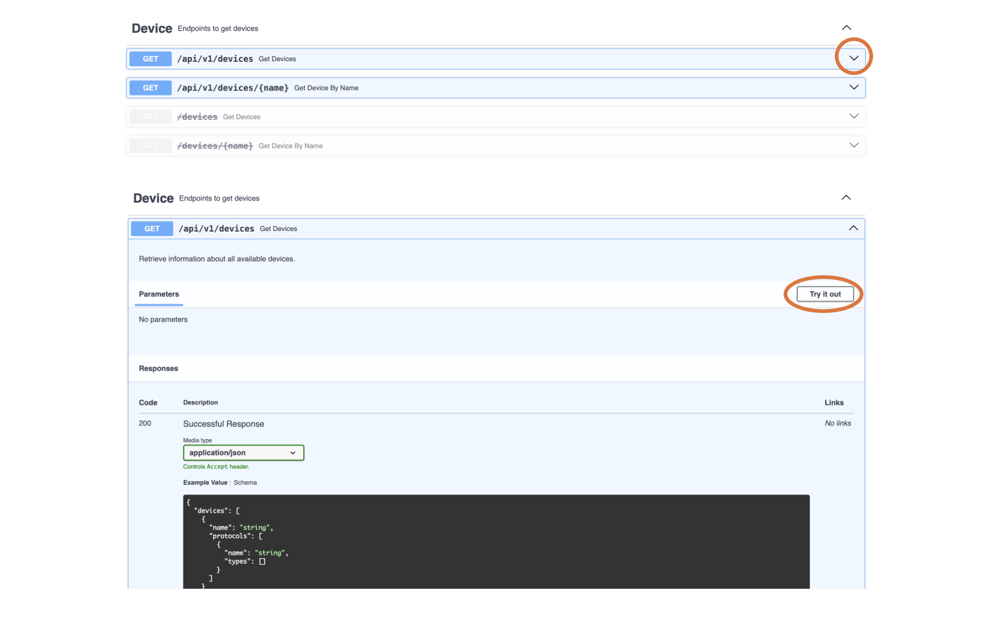
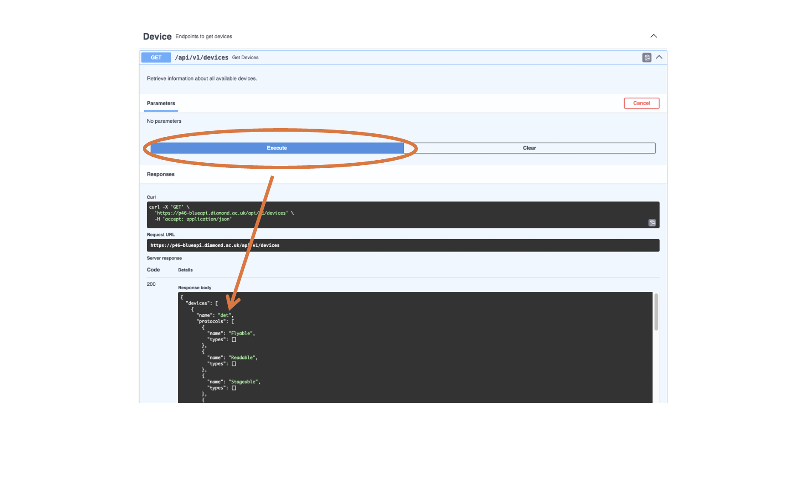
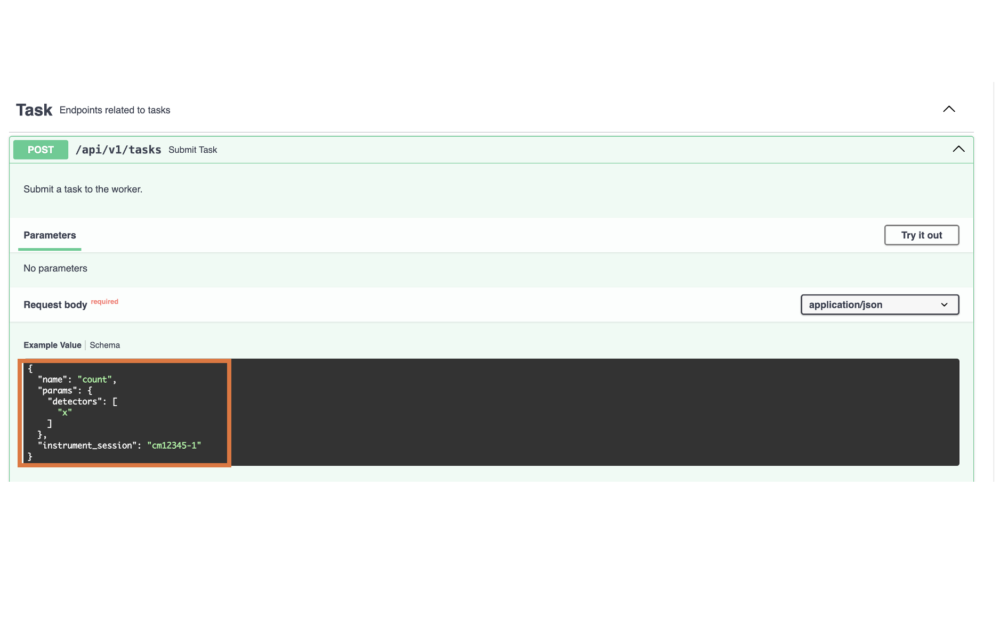
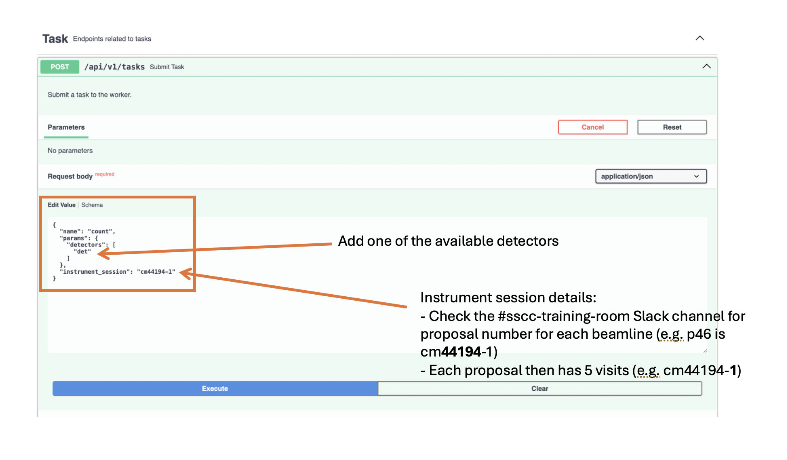
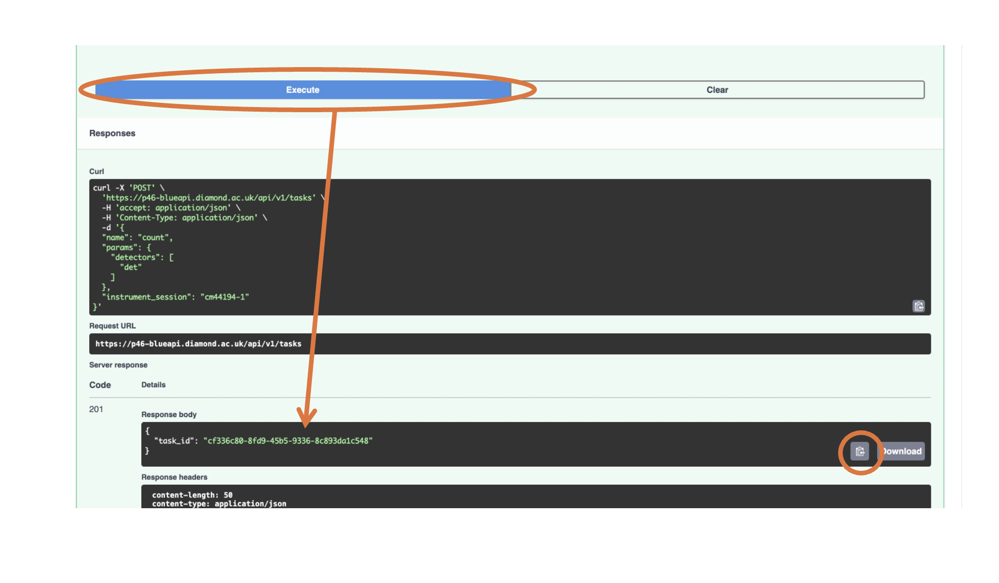
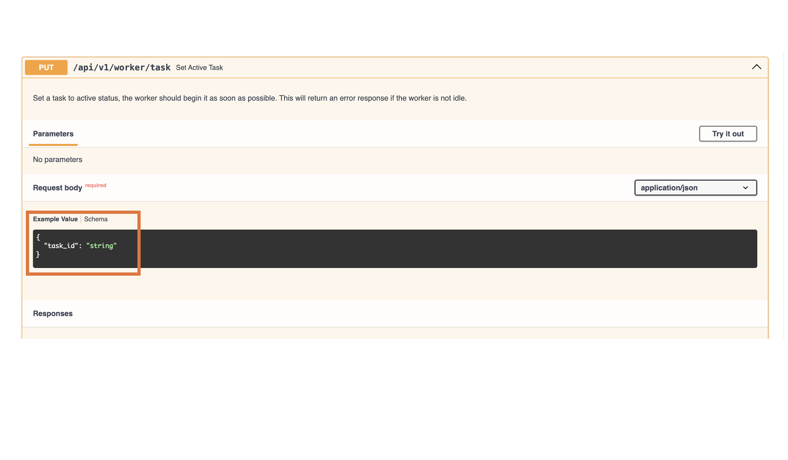
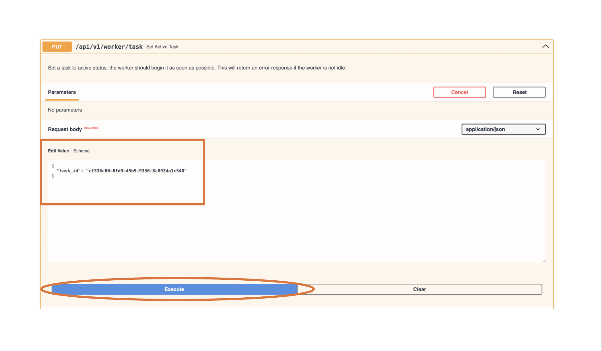
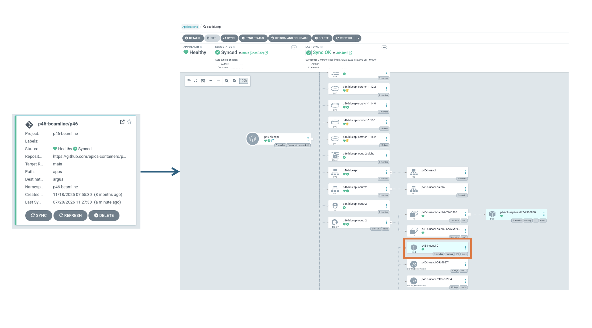
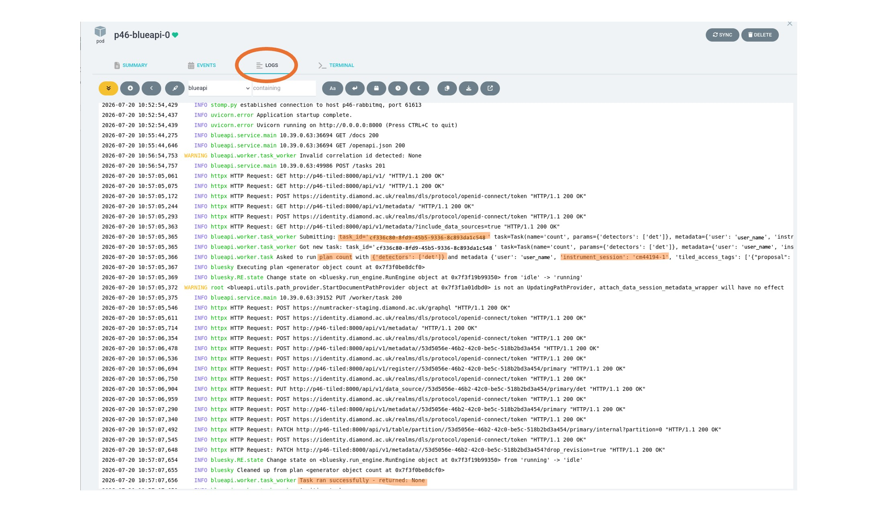

# Run a Plan from Docs page

:::{note}
This page describes how to run a plan from the docs page for the p-xx testing rigs. 
:::

Following [this link](https://p46-blueapi.diamond.ac.uk/docs), will take you to the blueapi docs for p46. After keycloak login, you should see the page below. 

Scrolling down will show you endpoints grouped. The different groups are described below. 

## Definitions:
- Plan: a set of instructions for one aspect of experiment orchestration. More details can be found [here](https://blueskyproject.io/bluesky/v1.13.1rc1/plans.html)
- Task: one individual instance of the plan being run. 
- Device: devices defined in ophyd-async(?). [This](https://blueskyproject.io/bluesky/v1.13.1rc1/tutorial.html#devices) is Bluesky's definition of a device. Maybe mention dodal here and add link?
- Environment - definition already provided
- Meta - definition already provided 

## Steps for running a plan
1. Find available devices. 

The first recommended step is to find out what devices are available for use to run a plan. Scroll down to the Get Devices endpoint (/api/v1/devices) and Press the downwards arrow which should expand it to show to 'Try it out' button. 

Next, press the 'Execute' button and scroll down to Responses where you should see available devices (e.g. 'det' in the example below). Select one of these devices. 

2. Submit a task using one of the available devices.

Scroll back up to the Submit Task endpoint (/api/v1/tasks). The default setting that should appear in the request body is the example of a 'count' task using detector 'x' and instrument session 'cm12345-1'. 

Press the 'Try it out' button and replace the placeholder 'x' in the request body with the device selected from step 1 ('det' in this example) and 'cm12345-1' with the correct instrument session details ('cm44194-1' in this example) which can be found on the #sscc-training-room slack channel. 

Press 'Execute' and you should receive a 201 response that contains a task_id. At the end of the response body box, press the clipboard symbol to copy this task_id. 

3. Create a task using the task_id generated

After posting a task, it still needs to be created so it is the active task. Scroll down to the Set Active Task endpoint (/api/v1/worker/task). The default for 'task_id' should be 'string.

Preess 'Try it out' and paste the copied task_id from earlier in the Request body.

Press the 'Execute' button. The BlueAPI docs page only provides feedback for submitting the task to be the active task. To check if the plan actually ran successfully, checks the logs (e.g. through ArgoCD, see below)

4. Check ArgoCD logs to confirm the plan ran successfully

Navigate to the ArgoCD page https://argocd.diamond.ac.uk/ and select the required application (p46-beamline/p46 in this example).Then click on the p46-blueapi-0 pod. 

Having opened the p46 blueapi pod, select 'LOGS' at the top and looks at the logs. Below, we can see in the highlighted secions that the correct task_id, plan (count), detector and instrument session were used. Towards the end of the logs is 'Task ran successfully - returned None' indicating that the plan did indeed run successfully. For more information on the count plan, you can look [here] (https://github.com/DiamondLightSource/dodal/blob/db980cba9cb22b9d4c603c6f1309ea5a5c419ab8/src/dodal/plans/wrapped.py#L31). (Note: We are not expecting an output from the count plan).

## Troubleshooting
- 401 Response/cannot Execute plan - reload whole BlueAPI docs web page and log-in again using Keycloak. 
- 2XX Task was created but could not be run successfully, no reponse - check logs for correct instrument session, have motor limits been exceeded?
- New plan changes have been pushed to the repo but the plan isn't showing up - may need to pull through PlanDev and re-load the environmant
- Make sure the blueapi pod is pointing to the correct commit in ArgoCD (check values.yaml file in p46-depolyment repo and change if require). 
    - Update values.yml as needed, Re-submit and re-cerate a task using BlueAPI and run again using same steps as above. 
